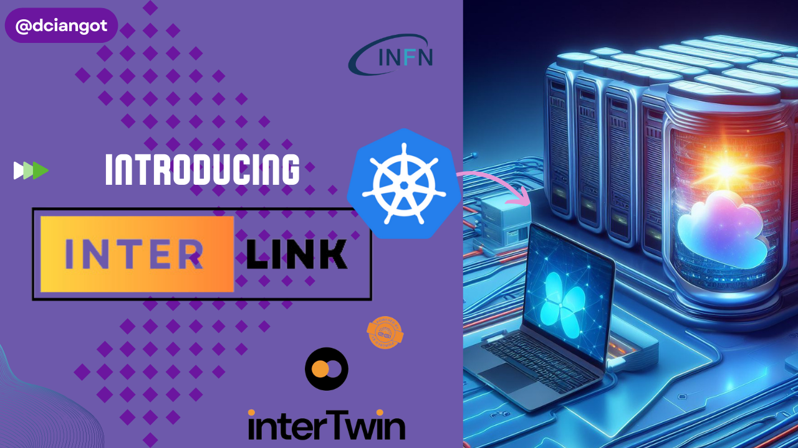

## :information_source: Overview

### Watch for a quick tour

### Introduction
InterLink aims to provide an abstraction for the execution of a Kubernetes pod on any remote resource capable of managing a Container execution lifecycle.

The project consists of two main components:

- __A Kubernetes Virtual Node:__ based on the [VirtualKubelet](https://virtual-kubelet.io/) technology. Translating request for a kubernetes pod execution into a remote call to the interLink API server.
- __The interLink API server:__ a modular and pluggable REST server where you can create your own Container manager plugin (called sidecars), or use the existing ones: remote docker execution on a remote host, singularity Container on a remote SLURM batch system.

The project got inspired by the [KNoC](https://github.com/CARV-ICS-FORTH/knoc) project, enhancing that with the implemention a generic API layer b/w the virtual kubelet component and the provider logic for the container lifecycle management.

## Quick references:
- [:information\_source: Overview](#information_source-overview)
  - [Watch for a quick tour](#watch-for-a-quick-tour)
  - [Introduction](#introduction)
- [Quick references:](#quick-references)
- [:fast\_forward: Quick Start](#fast_forward-quick-start)
- [:information\_source: InterLink Config file](#information_source-interlink-config-file)
- [:information\_source: Environment Variables list](#information_source-environment-variables-list)
- [Digging in the project](#digging-in-the-project)
  - [Virtual Kubelet](#virtual-kubelet)
  - [InterLink](#interlink)
  - [Sidecars](#sidecars)
    - [Docker Sidecar](#docker-sidecar)
    - [Slurm Sidecar](#slurm-sidecar)
- [GitHub repository management rules](#github-repository-management-rules)
  - [Merge management](#merge-management)
  - [Protection on main branch](#protection-on-main-branch)

## :fast_forward: Quick Start

Give it a stab at interLink [website](https://dciangot.github.io/interLink/). You will deploy on your laptop a fully emulated instance of a kubernetes cluster able to offload the execution of a pod to a SLURM cluster

## GitHub repository management rules

All changes should go through Pull Requests.

