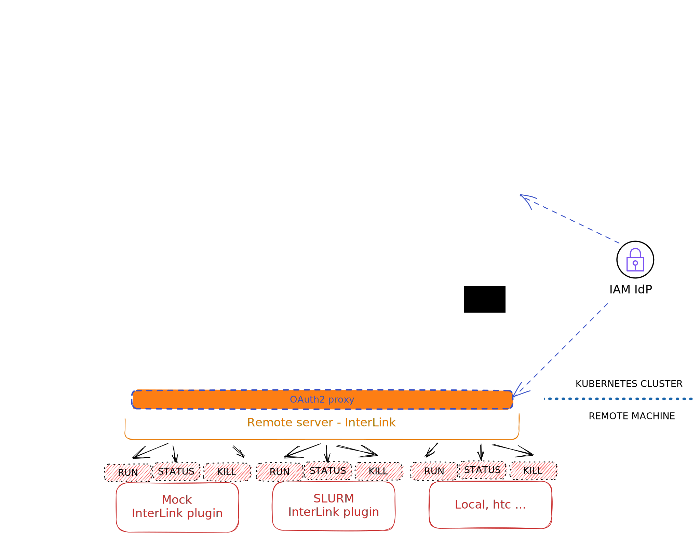

## :information_source: Overview

InterLink aims to provide an abstraction for the execution of a Kubernetes pod on any remote resource capable of managing a container execution lifecycle.

__Goals__:
- TBD

__Non-goals__:
- TBD

The project consists of two main components:

- __A Kubernetes Virtual Node:__ based on the [VirtualKubelet](https://virtual-kubelet.io/) technology. Translating request for a kubernetes pod execution into a remote call to the interLink API server.
- __The interLink API server:__ a modular and pluggable REST server where you can create your own container manager plugin (called sidecars), or use the existing ones: remote docker execution on a remote host, singularity container on a remote SLURM batch system.

The project is reusing and get inspired by the [KNoC](https://github.com/CARV-ICS-FORTH/knoc) boilerplates at different levels, implementing the generic API layer in place of an ssh execution as the original contribution.




This repository includes:

- License information
- Copyright and author information
- Code of conduct and contribution guidelines
- Templates for PR and issues
- Code owners file for automatic assignment of PR reviewers
- [GitHub actions](https://github.com/features/actions) workflows for linting
  and checking links

Content is based on:

- [Contributor Covenant](http://contributor-covenant.org)
- [Semantic Versioning](https://semver.org/)
- [Chef Cookbook Contributing Guide](https://github.com/chef-cookbooks/community_cookbook_documentation/blob/master/CONTRIBUTING.MD)


## Quick references:
- [:information\_source: Overview](#information_source-overview)
- [Quick references:](#quick-references)
- [:fast\_forward: Quick Start](#fast_forward-quick-start)
  - [Virtual node setup](#virtual-node-setup)
    - [:grey\_exclamation:  Requirements](#grey_exclamation--requirements)
    - [Bring up the virtual node](#bring-up-the-virtual-node)
  - [Setup a Dummy remote executer](#setup-a-dummy-remote-executer)
  - [:wrench: Kustomizing your Virtual Kubelet](#wrench-kustomizing-your-virtual-kubelet)
  - [Going serious with InterLink and Sidecars](#going-serious-with-interlink-and-sidecars)
  - [:information\_source: InterLink Config file](#information_source-interlink-config-file)
  - [:information\_source: Environment Variables list](#information_source-environment-variables-list)
- [GitHub repository management rules](#github-repository-management-rules)
  - [Merge management](#merge-management)
  - [Protection on main branch](#protection-on-main-branch)

## :fast_forward: Quick Start

### Virtual node setup

#### :grey_exclamation:  Requirements

- A working Kubernetes instance >1.24
  - if you are in a hurry:
    - `curl -sfL https://get.k3s.io |  INSTALL_K3S_VERSION=v1.25.11+k3s1 INSTALL_K3S_EXEC="--tls-san X.X.X.X" sh -s - --disable traefik --disable metric-server`
      - you do need `--tls-san X.X.X.X` only in case of a machine with a Floating IP attached 
      - `k3s kubect get node` to check whenever the cluster is ready
- Kubectl
- Docker 

#### Bring up the virtual node

Fastest way to start using interlink, is by deploying a VK in Kubernetes using the prebuilt image:

```bash
kubectl create ns vk
kubectl apply -n vk -k ./kustomizations
```

In `./kustomizations` you can then play with the different configuration and deployment files in order to customize your setup, as described [here](#wrench-kustomizing-your-virtual-kubelet) .

### Setup a Dummy remote executer

- Use Docker Compose to create and start up containers:
    ```bash
    docker compose -f docker-compose.yaml up -d
    ```
- You are now running:
    - A Virtual Kubelet
    - The InterLink service
    - A Docker Sidecar
- Submit a YAML to your K8S cluster to test it. You could try:
    ```bash
    kubectl apply -f examples/busyecho_k8s.yaml -n vk
    ```
You will see now a container starting up on your host, but managed by the docker compose interlink daemons.

### Digging in the project

As previous described, the whole project is split across 3 major components:
- A Virtual Kubelet
- The InterLink API
- A Sidecar  
But what actually happens inside every component?

#### Virtual Kubelet
The Virtual Kubelet is of course based on the latest Virtual Kubelet release, provided by Kubernetes itself. Being actually a Kubelet, every Pod submitted to the cluster is then registered to the Kubelet if taints and selectors actually match.  
The first thing done by the Virtual Kubelet is attempting a communication with the InterLink API to send a ServiceAccount configuration, which will then be used by the InterLink API to retrieve from the cluster everything needed by Sidecars. If some error occurs in this phase, the Virtual Kubelet aborts its execution, since the configuration is crucial to InterLink's proper working.
After that, the VK starts its actual work by managing any basic Pod operation, like adding, removing, quering, etc pods to/from the cluster.  
While a Pod is being registered, upon a `kubectl apply -f yaml_file.yaml` command for example, the Kubelet sends a Create HTTP call to the InterLink API.
If at least 1 Pod is registered to the Kubelet, every 5 seconds, a Status HTTP call to the InterLink API is automatically issued to check every Pod's health. If a job executed by a Pod is terminated (returning errors or not) or if a service supposed to run is not running anymore, the Pod is being removed from the Kubernetes Cluster by the Kubelet itself.  
Another way to remove a running Pod is by manually executing a `kubectl delete pod pod_name` command from the CLI. This triggers the sending of Delete HTTP call to the InterLink API and the deletion of the Pod from the Kubernetes cluster.  
Every HTTP call is performed as a REST standard call, specifing the interlink path, the interlink port and a fixed path, according to the call; for example  `http://localhost:3000/create` is a create call on a InterLink being run on the same VK machine on the port 3000. InterLink path and port can be specified in the InterLinkConfig.yaml file. The body of every call is the same: a marshalled (JSON type) list of Pod descriptors, stored in variables of type v1.Pod, a built-in go-client standard Kubernetes type.  
A quick recap to the list of HTTP calls:
| Call         | URL     |
|--------------|-----------|
| Create | InterLinkUrl:InterLinkPort/create|
| Delete | InterLinkUrl:InterLinkPort/delete|
| Status | InterLinkUrl:InterLinkPort/status|

#### InterLink
InterLink is the middleware in charge to translate Virtual Kubelet's HTTP calls in a standard, agnostic output understandable to whatever plugin, called in this context Sidecar, below him.  


### :wrench: Kustomizing your Virtual Kubelet

To customize your virtual node deployment edit the configuration files within the kustomizations directory:
- `kustomization.yaml`: here you can specify resource files and generate configMaps
- `deployment.yaml`: that's the main file you want to edit. Nested into spec -> template -> spec -> containers you can find these fields:
    - name: the container name
    - image: Here you can specify which image to use, if you need another one. 
    - args: These are the arguments passed to the VK binary running inside the container.
    - env: Environment Variables used by kubelet and by the VK itself. Check the ENVS list for a detailed explanation on how to set them.
- `knoc-cfg.json`: it's the config file for the VK itself. Here you can specify how many resources to allocate for the VK. Note that the name specified here for the VK must match the name given in the others config files.
- `InterLinkConfig.yaml`: configuration file for the inbound/outbound communication (and not only) to/from the InterLink module. For a detailed explanation of all fields, check the [InterLink Config File](#information_source-interlink-config-file) section.
If you perform any change to the listed files, you will have to
```bash
kubectl apply -n vk -k ./kustomizations
```
You can also use Environment Variables to overwrite the majority of default values and even the ones configured in the InterLink Config file. Check the [Environment Variables list](#information_source-environment-variables-list) for a detailed explanation.

### Going serious with InterLink and Sidecars

__You can find instructions on how to get started with installation script (itwinctl) [here](./docs/README.md).__


### :information_source: InterLink Config file
Detailed explanation of the InterLink config file key values.
| Key         | Value     |
|--------------|-----------|
| InterlinkURL | the URL to allow the Virtual Kubelet to contact the InterLink module. |
| SidecarURL | the URL to allow InterLink to communicate with the Sidecar module (docker, slurm, etc). Do not specify port here |
| InterlinkPort | the Interlink listening port. InterLink and VK will communicate over this port. |
| SidecarPort | the sidecar listening port. Sidecar and Interlink will communicate on this port. Set $SIDECARPORT environment variable to specify a custom one |
| SbatchPath | path to your Slurm's sbatch binary |
| ScancelPath | path to your Slurm's scancel binary | 
| VKTokenFile | path to a file containing your token fot OAuth2 proxy authentication. |
| CommandPrefix | here you can specify a prefix for the programmatically generated script (for the slurm plugin). Basically, if you want to run anything before the script itself, put it here. |
| ExportPodData | Set it to true if you want to export Pod's ConfigMaps and Secrets as mountpoints in your Singularity container |
| DataRootFolder | Specify where to store the exported ConfigMaps/Secrets locally |
| ServiceAccount | The Service Account name to generate a limited KubeConfig to be passed to your Sidecars |
| Namespace | Namespace where Pods in your K8S will be registered |
| Tsocks | true or false values only. Enables or Disables the use of tsocks library to allow proxy networking. Only implemented for the Slurm sidecar at the moment. |
| TsocksPath | path to your tsocks library. |
| TsocksLoginNode | specify an existing node to ssh to. It will be your "window to the external world" |

### :information_source: Environment Variables list
Here's the complete list of every customizable environment variable. When specified, it overwrites the listed key within the InterLink config file.

| Env         | Value     |
|--------------|-----------|
| VK_CONFIG_PATH | VK config file path |
| INTERLINKURL | the URL to allow the Virtual Kubelet to contact the InterLink module. Do not specify a port here. Overwrites InterlinkURL. |
| INTERLINKPORT | the InterLink listening port. InterLink and VK will communicate over this port. Overwrites InterlinkPort. |
| INTERLINKCONFIGPATH | your InterLink config file path. Default is `./kustomizations/InterLinkConfig.yaml` |
| SIDECARURL | the URL to allow InterLink to communicate with the Sidecar module (docker, slurm, etc). Do not specify port here. Overwrites SidecarURL. |
| SIDECARPORT | the Sidecar listening port. Docker default is 4000, Slurm default is 4001. |
| SBATCHPATH | path to your Slurm's sbatch binary. Overwrites SbatchPath. |
| SCANCELPATH | path to your Slurm's scancel binary. Overwrites ScancelPath. |
| VKTOKENFILE | path to a file containing your token fot OAuth2 proxy authentication. Overwrites VKTokenFile. |
| SHARED_FS | set this env to "true" to save configmaps values inside files directly mounted to Singularity containers instead of using ENVS to create them later |
| CUSTOMKUBECONF | path to a service account kubeconfig |
| TSOCKS | true or false, to use tsocks library allowing proxy networking. Working on Slurm sidecar at the moment. Overwrites Tsocks. |
| TSOCKSPATH | path to your tsocks library. Overwrites TsocksPath. |

## GitHub repository management rules

All changes should go through Pull Requests.

### Merge management

- Only squash should be enforced in the repository settings.
- Update commit message for the squashed commits as needed.

### Protection on main branch

To be configured on the repository settings.

- Require pull request reviews before merging
  - Dismiss stale pull request approvals when new commits are pushed
  - Require review from Code Owners
- Require status checks to pass before merging
  - GitHub actions if available
  - Other checks as available and relevant
  - Require branches to be up to date before merging
- Include administrators
